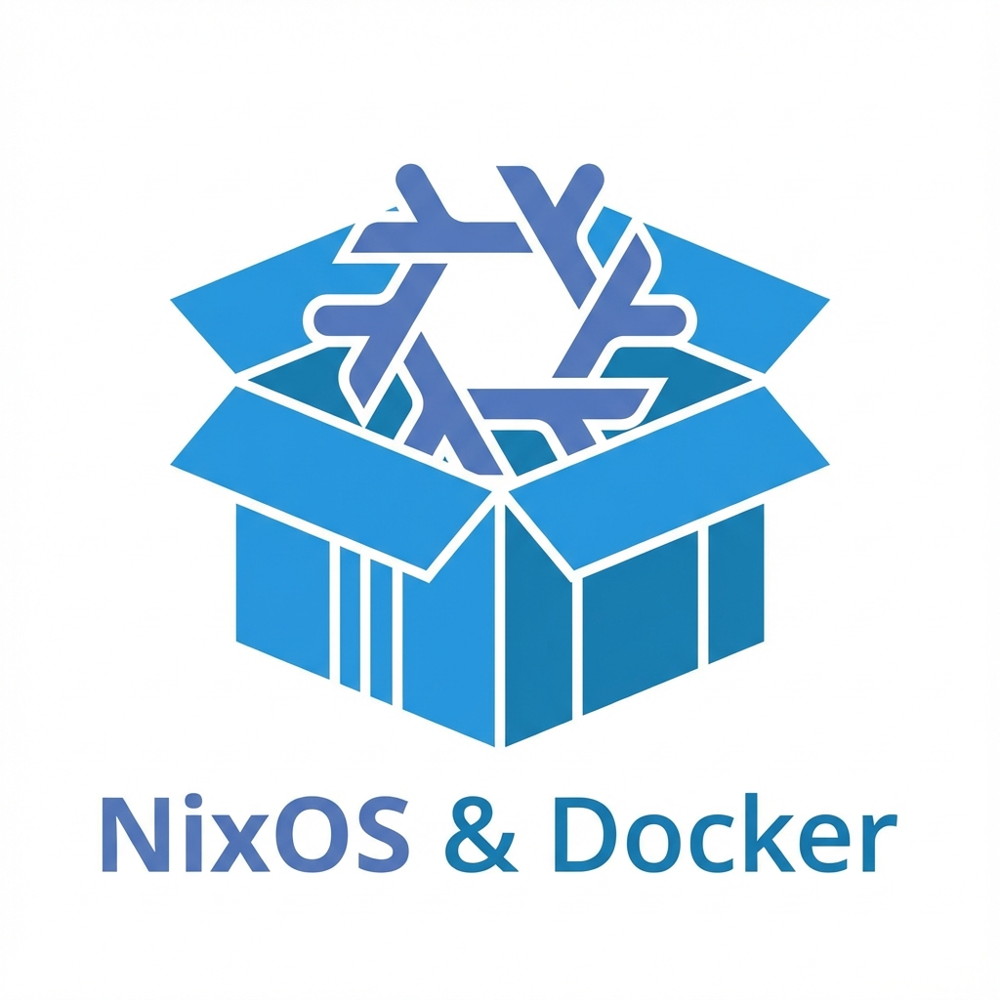

# NixOS 家庭服务器配置




本仓库包含一份用于家庭服务器的 NixOS 配置，功能包括用于容器管理的 Podman、用于图形化管理的 Portainer 以及作为反向代理的 Caddy。

## 功能特性

- **操作系统**: NixOS (基于 Flake)
- **容器引擎**: Podman (兼容 Docker)
- **容器管理**: Portainer (可通过 `pd.home.lan` 访问)
- **反向代理**: Caddy
  - `home.lan`: 欢迎页面
  - `pd.home.lan`: Portainer
  - `*.home.lan`: 泛域名占位符
- **远程访问**: 已启用 SSH

## 安装指南

1.  **克隆仓库** 到 `/etc/nixos` (或创建软链接):
    ```bash
    git clone https://github.com/yourusername/nixos-config.git /etc/nixos
    ```

2.  **生成硬件配置**:
    如果是全新安装，请生成针对您硬件的配置文件:
    ```bash
    nixos-generate-config --show-hardware-config > /etc/nixos/hardware-configuration.nix
    ```
    *注意: 仓库中包含的 `hardware-configuration.nix` 仅为占位符。*

3.  **应用配置**:
    ```bash
    nixos-rebuild switch --flake .#nixos-server
    ```

4.  **DNS 设置**:
    确保您的本地 DNS 或客户端 `hosts` 文件将 `home.lan`、`pd.home.lan` 以及其他子域名指向服务器的 IP 地址。

## 自定义

- **用户**: 编辑 `configuration.nix` 以设置您的用户名和 SSH 密钥。
- **时区/语言**: 如果不在 Asia/Shanghai (中国标准时间)，请在 `configuration.nix` 中进行调整。

## 构建 Proxmox VMA 镜像

本仓库包含用于构建 Proxmox VE (VMA) 镜像的工具。

### 使用 GitHub Actions 构建 (推荐)

本仓库配置了 GitHub Actions 工作流，可以自动构建 VMA 镜像。

1.  转到仓库的 **Actions** 标签页。
2.  选择 **Build VMA Image** 工作流。
3.  点击 **Run workflow** 按钮。
4.  构建完成后，可以在 **Summary** 页面下载 `nixos-vma-image` 构建产物。

### 本地构建 (使用 Docker)

如果您安装了 Docker，可以使用以下命令在本地构建镜像：

```powershell
./nixos-win/run-docker.ps1
```

构建产物将生成在当前目录下。

### 本地构建 (使用 Nix)

如果您在 NixOS 或安装了 Nix 的系统上，可以直接运行构建脚本：

```bash
./nixos-win/build-vma.sh
```
